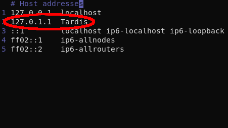

# About

qrTransfer is a simple utility software to send files between your pc and mobile devices if they are in the **same network**.

### How it works?

When you select a file to transfer, it is copied to another folder and made available in your local network. So the qr code contains the copy download address.  When closing the qr code window the copy will be erased, that's why you must wait your download finish before close it.

For a transferrence from the mobile device, after install a shortcut "qrTransfer-MTP" were added to your system. Open it, scan the code and open the upload page.

### How secure is it?

This depends most on your local network. If you're in a network that you trust (like your home) is pretty safe. If you're in a public network you are not that secure, but for small (and probably unimportant) files should be no problem. Besides that, there is at least one thing or two to be implemented in the next versions to improve security.

# Install

First of all, there is a lot of room for improvements here and I plan to create a graphical installer in a time to come, but for now please continue with these simple versions.

Download qrTransfer [here](https://github.com/WesleyMPG/qrTransfer/releases).

###  Windows

- Download the corresponding release;
- Extract the folder;


- Execute 'Install' file as administrator;
- Agree with the license

### Linux

- Download the corresponding release;
- Extract the folder;


- Execute 'install.sh' in a terminal;
- Agree with the license;
- Select your file manager


### MacOS

It should work on Mac, but I don't have a way to test it. You could download the source and test through python. Checkout the build section for building instructions.

# Usage

Right-click on a file and look for the corresponding sub-menu:

- Windows - A dialog of windows defender firewall will appear, click 'allow acess' and you're good to go. This is for the server be visible in your network.


- Nautilus


- Dolphin


- Thunar


After this in a few seconds a qr code will pop up on your screen:


Then take your mobile device camera and read it to start the download (older devices may need an external qr code reading app). Also a shortcut were added to your system: "qrTransfer-MTP". It can be used to send files from your **M**obile device **T**o your **P**c. Open it, scan the code and open the upload page.

The context menu functionality currently has support only for the file managers mentioned above but you can search how to add it to your file manager. However you still can use it through command line.

At terminal you can do:
```shell
$ qrTransfer -p path_to_file # to send
$ qrTransfer -mtp # to receive
```

# Build

Please read it all before doing.

### Environment

Clone source:

```shell	
$ git clone https://github.com/WesleyMPG/qrTransfer.git
```

To setup the environment you must have at least python 3.6 and run:

```shell
$ pip install -r requirements.txt
$ pip install pyinstaller
```

If you're using a conda env, remove kivy from 'requirements.txt' and do the same. Then to install kivy do:

```shell
$ conda install -c conda-forge kivy
```
After that you're able to run main.py.

### Building
There are scripts to do an automated build and generate a folder with the same content of a release. Just run:

```shell
$ cd qrTransfer 
$ src/scripts/linux/build.sh # on linux

$ src/scripts/windows/build.bat # on windows
```

# Known issues

- About Thunar support: there is a bug in Thunar send to menu and none of the shorcuts that use %F or %U currently work properly. Instead opening one instance of an application passing all selected files as arguments, they open several instances passing one file to each. There is nothing I can do about it. However, you can use the command line to send files or compress them before sending.

- On windows when you open qrTransfer a terminal window is opened.  I'm not sure if it's a bug in pyinstaller or in kivy but I still couldn't get it solved.

- On linux if you have an entry on /etc/hosts with your pc name qrTransfer will get that ip rather your local network ip. It happened to me specifically on Arch and Manjaro. Removing that line solves the problem. Example:

    